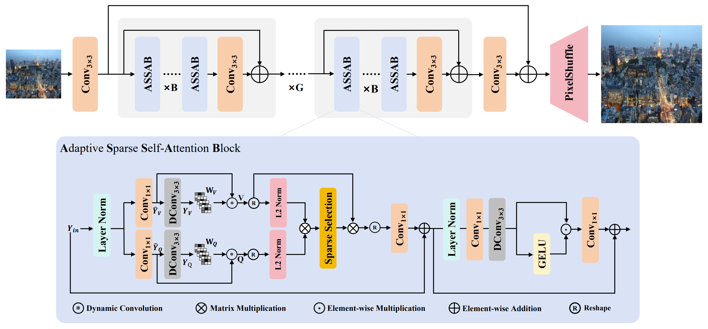
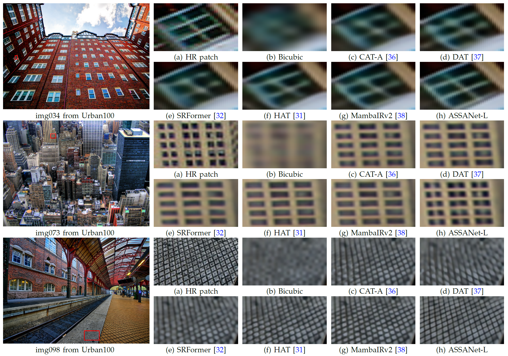
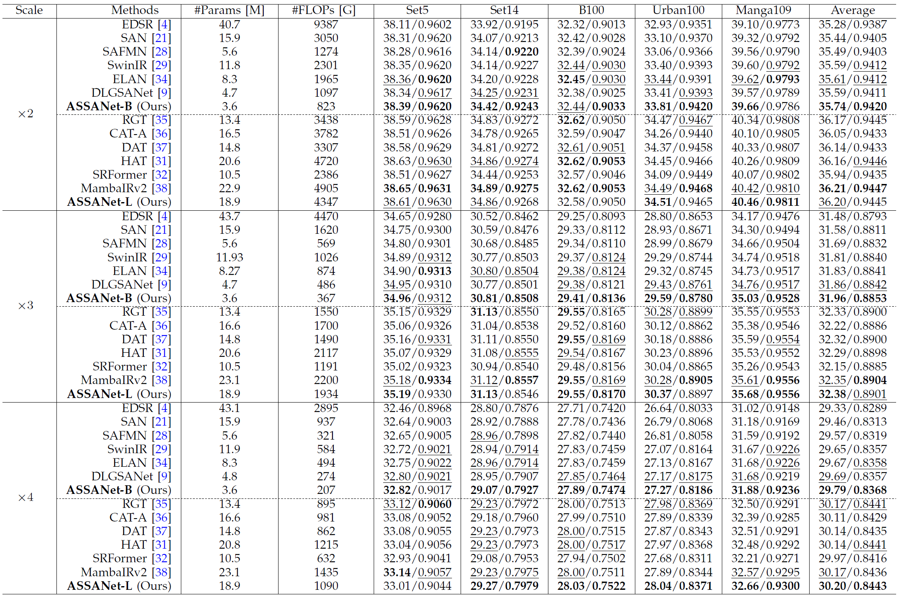
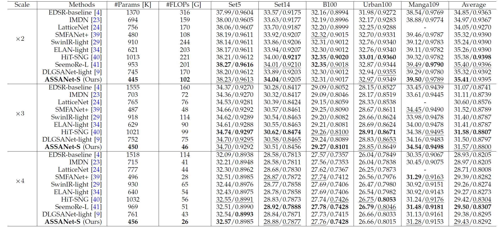
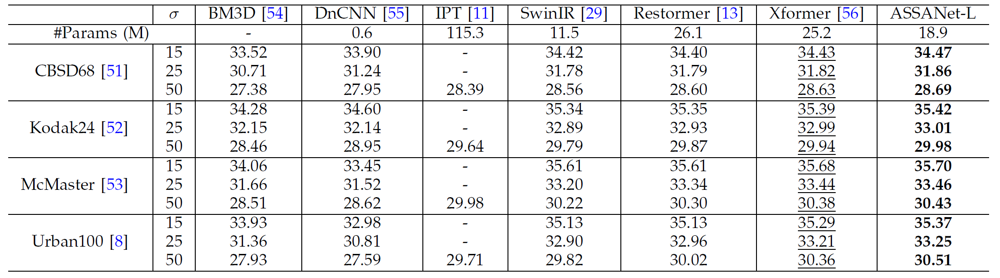
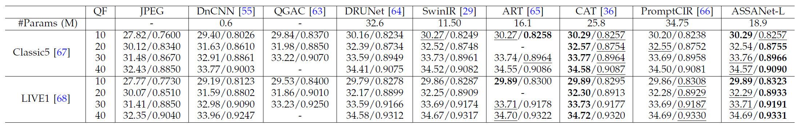

## 📖 Adaptive Sparse Self-Attention for Efficient Image Super-resolution and Beyond

[]()
[]()
 

> [Jinshan Pan](https://jspan.github.io/), [Long Sun](https://github.com/sunny2109), Lianhong Song, [Jiangxin Dong](https://scholar.google.com/citations?user=ruebFVEAAAAJ&hl=zh-CN&oi=ao), [Jian Yang](https://scholar.google.com/citations?hl=zh-CN&user=6CIDtZQAAAAJ), Maocheng Zhao, [Jinhui Tang](https://scholar.google.com/citations?user=ByBLlEwAAAAJ&hl=zh-CN)<br>
> [IMAG Lab](https://imag-njust.net/), Nanjing University of Science and Technology

---


## 📜 News
- **2026.02.10**: This repo is created.

## 🚀 Method Overview
<div align="center">
    
</div>

ASSANet is an efficient image super-resolution network based on adaptive sparse self-attention.
It first introduces a local spatial-variant feature estimation module to better capture local details,
and then employs a sparse self-attention mechanism to adaptively select the most relevant token similarities for effective and lightweight feature aggregation.


## 👀 Demos
<div align="center">
    
</div>


## 🚀 Quick Started
<!-- ### 1. Environment Set Up
> - Python 3.8, PyTorch >= 1.11
> - BasicSR 1.4.2
> - Platforms: Ubuntu 18.04, cuda-11

```bash
git clone https://github.com/sunny2109/RDG.git
cd RDG
conda create -n rdg python=3.8
conda activate rdg
# Install dependent packages
pip install -r requirements.txt
# Install BasicSR
python setup.py develop
```

### 2. Run the training code
```
# train RDG for x4 effieicnt SR
python basicsr/train.py -opt options/train/train_RDG_x4.yml
```

### 3. Quick inference
- Download the pretrained models.

Please download the pretrained [model weights](https://github.com/sunny2109/RDG/tree/main/checkpoints) and put it in `./checkpoints/`.
- Download the testing dataset.

Please download the test dataset from [Baidu Cloud](https://pan.baidu.com/s/1v7-0KaXdTPDMaO_wfBQkhg?pwd=RRDG) and put it in `./datasets/`.
- Run the following commands:
```
python basicsr/test.py -opt options/test/test_RDG_x4.yml
```
- The test results will be in './results'. -->


## ✨ Results
We achieve SOTA performance on a set of restoration datasets. Detailed results can be found in the paper. All visual results of ASSANet can be downloaded [here]().

- **Classical image SR**
<p align="center">
  
</p>

- **Lightweight image SR**
<p align="center">
  
</p>

- **Color gaussian denosing**
<p align="center">
  
</p>


- **Grayscale image JPEG compression artifact removal**
<p align="center">

</p>


## 📧 Contact
If you have any questions, please feel free to reach us out at cs.longsun@gmail.com


<!-- ## 📎 Citation

If you find our work helpful for your research, please consider giving a star ⭐ and citation 📝
```bibtex
@InProceedings{RDG,
  title={Efficient Video Super-Resolution for Real-time Rendering with Decoupled G-buffer Guidance},
  author={Zheng, Mingjun and Sun, Long and Dong, Jiangxin and Pan, Jinshan},
  booktitle={CVPR},
  year={2025}
} -->
